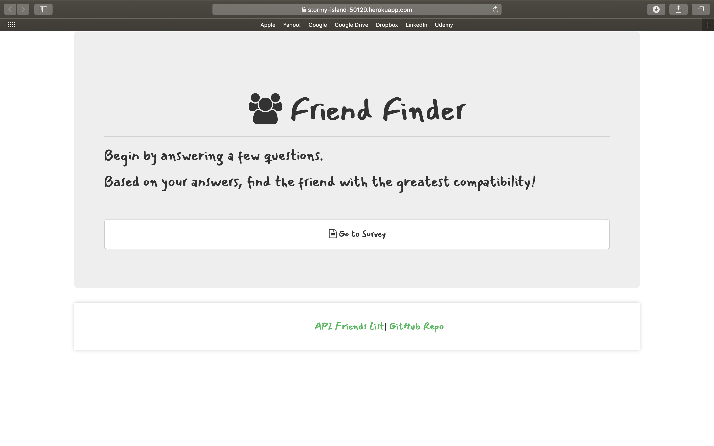
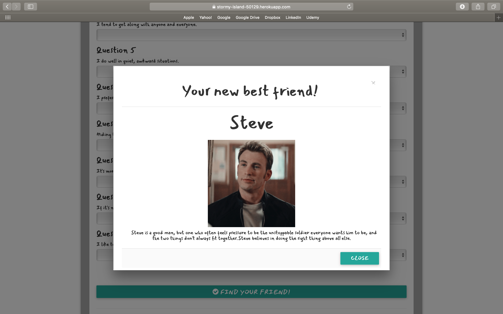

# FriendFinder

Are you in need of a friend? After filling out a quick survey, our friend-matching algorithm will pair you with an individual in our network.

## Live Link
 - https://stormy-island-50129.herokuapp.com/

## Preview



To use this app, simply go to the provded website and take our survey. 
After submitting the survey, a picture and a brief description of your new best friend will populate. 



We also have an API you can access to the network's users and their personalized information.


## Technologies Used

- JavaScript
- jQuery
- node.js
- Express.js
- HTML
- CSS
- Bootstrap


```js
{
	name: "Tony",
		photo: "https://www.thewrap.com/wp-content/uploads/2017/07/Robert-Downey-Jr-Iron-Man-Pepper-Potts-Tony-Stark.jpg",
		scores: [2, 1, 4, 5, 1, 3, 2, 5, 2, 1],
		message: "He's complicated, a little self-absorbed, and sometimes moody. Tony is perceptive enough to identify his shortcomings and find people to shore up his weaknesses."
}
```